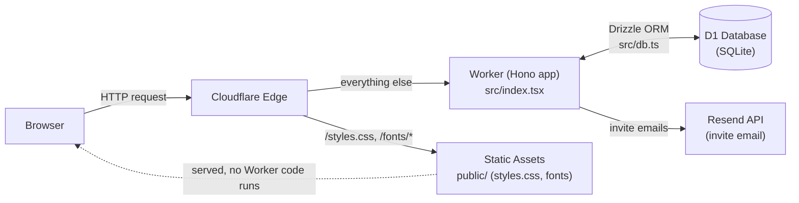
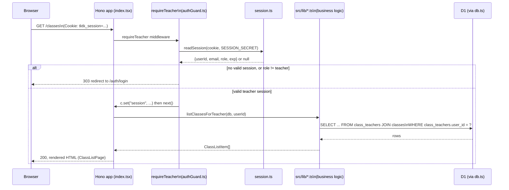
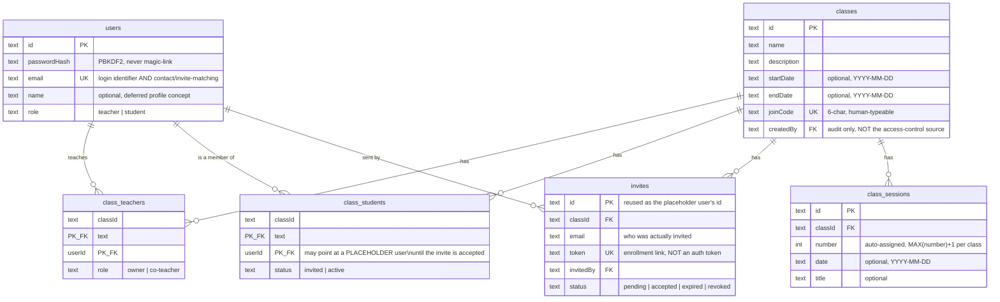
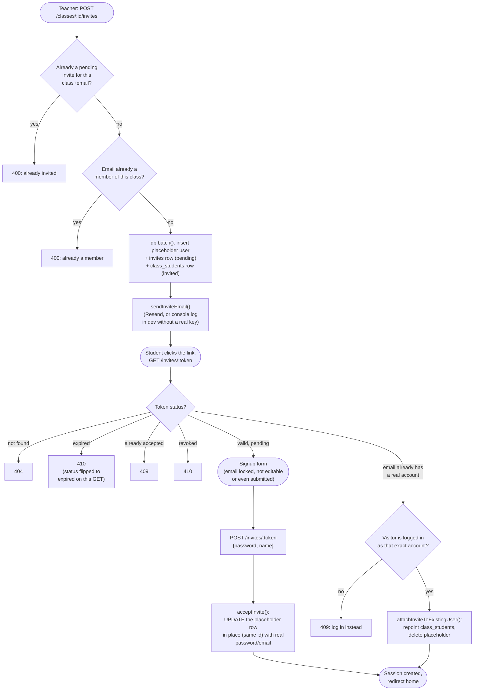
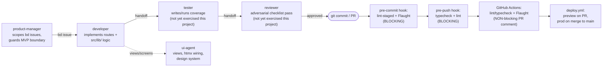

# Architecture

A human-readable tour of how tktk is built, as of 2026-08-30 (4 of 7 MVP issues complete — see `bd show tktk-lfc`). For conventions and decisions-with-rationale, see `CLAUDE.md`; this document is about *how the pieces fit together*, not why each choice was made.

## 1. System overview

tktk is a single Cloudflare Worker — no separate frontend build, no separate API server. One request handler (Hono) renders server-side HTML (Hono JSX) and reads/writes one D1 database. Static assets (the stylesheet, self-hosted font files) are served directly by Cloudflare's edge, bypassing the Worker entirely.

No client-side JavaScript framework runs in the browser. htmx 4.0 is loaded (pinned, self-hosted-adjacent via CDN — see `htmx-4.0-notes.md`) but none of the views built so far actually use `hx-*` attributes; every form is a plain `method="post"` with a full-page redirect. That was a deliberate, per-view choice (see each view file's header comment), not an oversight — htmx is there for when a flow genuinely needs partial-page interactivity, which hasn't come up yet.

## 2. Request lifecycle (a typical authenticated request)

Every protected route follows this same shape: `requireTeacher` middleware gates access, a `src/lib/*.ts` module holds the actual query/mutation logic (never inline in the route handler — `CLAUDE.md` rule 3), and `src/db.ts` is the *only* place that touches the D1 binding directly.

## 3. Data model

**Two things that aren't obvious from the diagram alone:**

- **Class access is scoped through `class_teachers`, never `classes.createdBy`.** `createdBy` is an audit field (who originally made the class); the actual "can this user see/edit this class" check always joins through `class_teachers`. This was a deliberate choice made *before* co-teacher support existed (`tktk-lfc.3`, not yet built), specifically so that feature won't need every existing query rewritten when it lands.
- **The placeholder-user pattern (invites).** `class_students.userId` is `NOT NULL` and foreign-keyed to `users.id`, enforced eagerly by D1 — but an invited student doesn't have a real account until they accept. `createInvite` (`src/lib/invites.ts`) inserts a placeholder `users` row (unusable credentials, an RFC 2606 `*.invalid` email) using the invite's own `id` as the placeholder's `id`, so `acceptInvite` can convert it in place at signup with no extra lookup. See the module-level comment in `src/lib/invites.ts` for the full reasoning — this is the single most subtle piece of the current schema.

## 4. Auth flow

```mermaid
sequenceDiagram
    participant B as Browser
    participant W as index.tsx
    participant A as auth.ts
    participant P as password.ts
    participant S as session.ts
    participant D as D1

    rect rgb(30, 40, 50)
    Note over B,D: Signup (teacher self-registration only)
    B->>W: POST /auth/signup {email, password}
    W->>A: signupTeacher(db, input)
    A->>D: check email uniqueness
    A->>P: hashPassword(password)
    P-->>A: PBKDF2 hash (210k iterations)
    A->>D: INSERT users (role: teacher)
    A-->>W: {ok, user}
    W->>S: createSessionCookie(userId, email, role)
    W-->>B: 303 -> /classes, Set-Cookie
    end

    rect rgb(30, 40, 50)
    Note over B,D: Login
    B->>W: POST /auth/login {email, password}
    W->>A: verifyLogin(db, input)
    A->>D: find user by email
    alt user not found
        A->>P: verifyPassword(password, DUMMY_HASH)
        Note right of A: still runs a full PBKDF2 derivation --<br/>closes a timing side-channel that would<br/>otherwise let response time alone reveal<br/>whether the email exists
    else user found
        A->>P: verifyPassword(password, user.passwordHash)
    end
    P-->>A: true/false
    alt invalid
        A-->>W: null
        W-->>B: 400, "Invalid email or password."\n(identical message either way)
    else valid
        A-->>W: {id, email, role}
        W->>S: createSessionCookie(...)
        W-->>B: 303 -> /classes, Set-Cookie
    end
    end
```

Sessions are **stateless signed cookies** (`src/lib/session.ts`) — no session table, no KV namespace. The cookie holds a base64url JSON payload plus an HMAC-SHA256 signature keyed by `SESSION_SECRET`; `readSession` rejects a tampered or expired cookie by returning `null`, never throwing.

## 5. Invite flow

The most involved flow in the app so far — a teacher inviting a student who may or may not already have an account.

## 6. Route map

| Route | Auth | Purpose |
|---|---|---|
| `GET /` | none | Placeholder home |
| `GET /auth/signup`, `POST /auth/signup` | none | Teacher self-registration |
| `GET /auth/login`, `POST /auth/login` | none | Login |
| `POST /auth/logout` | none (clears cookie either way) | Logout |
| `GET /classes` | `requireTeacher` | Teacher's class list + create-class form |
| `POST /classes` | `requireTeacher` | Create a class (+ owner `class_teachers` row) |
| `GET /classes/:id` | `requireTeacher` + class membership | Class detail, join code, teachers, pending invites |
| `POST /classes/:id/invites` | `requireTeacher` + class membership | Invite a student by email |
| `GET /invites/:token`, `POST /invites/:token` | none (public — the token *is* the auth) | Invite acceptance / student signup |

**Not yet built:** anything under a join-code route (`tktk-lfc.5`), co-teacher add/remove UI (`tktk-lfc.3`), the full roster view with active-student listing and removal (`tktk-lfc.6`), and any student-facing page — a student who signs up currently lands on the same placeholder `/` page a logged-out visitor sees.

## 7. Agentic development workflow

In practice this session, `developer` and `ui-agent` passes have been the ones exercised (`tester`/`reviewer` roles have mostly been done by the orchestrating session directly — independent re-verification against a real local D1 after each subagent's own report, rather than a separate `tester`/`reviewer` handoff). Every commit still goes through the two blocking local hooks regardless of which agent made it.

## 8. What's deliberately not here yet

Scope boundaries from `CLAUDE.md`, not gaps to fill reflexively: no assignments, submissions, feedback/grading, or peer-review features (that's the *next* milestone, after this class+roster MVP). No persistent staging environment — prod + PR previews only, and PR preview database isolation itself isn't designed yet (`docs/deployment.md` "Known gap"). No dark mode. No test suite. See `bd show tktk-lfc` for exactly what's open.
